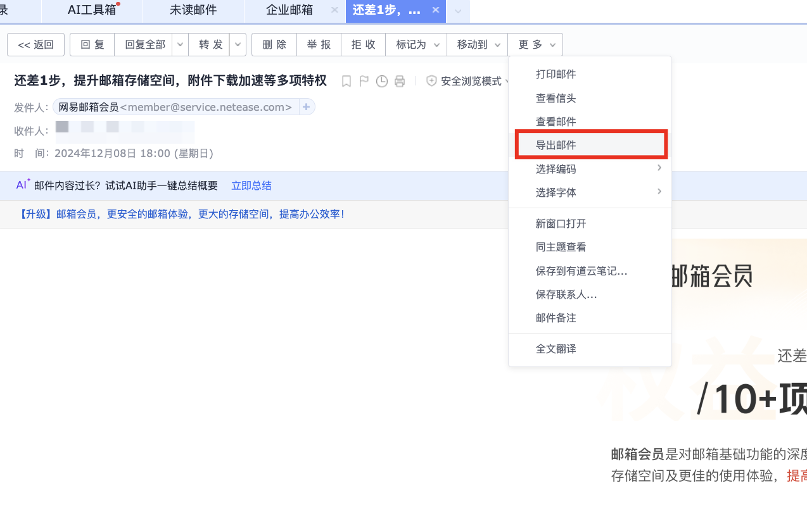
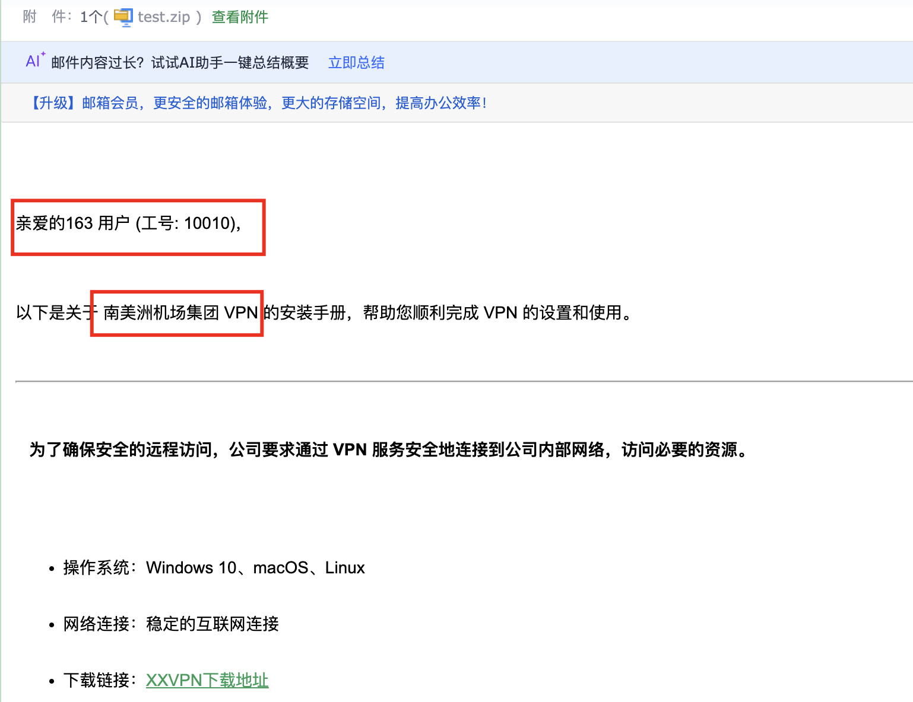
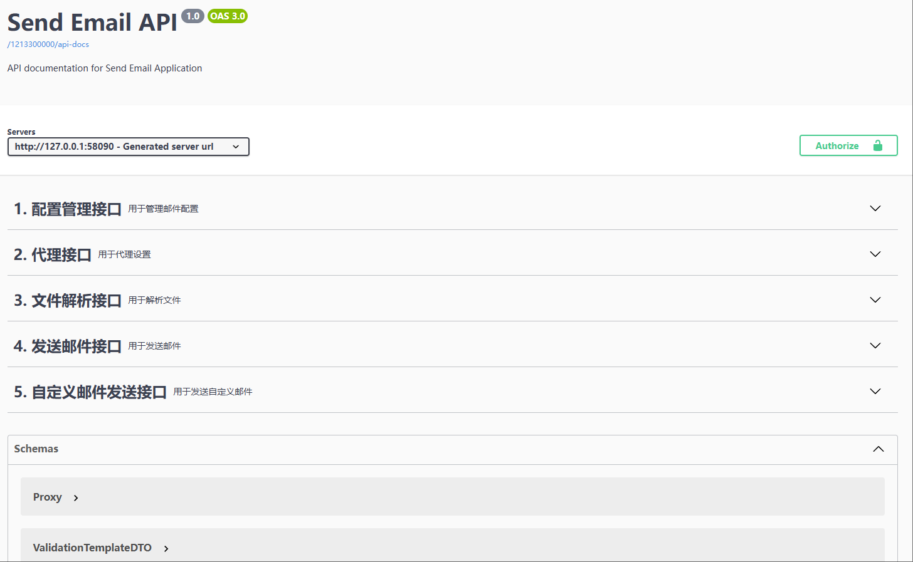

# Send_Email

> 一款轻量化可定制模板的邮件批量发送工具 | 可用于攻防钓鱼或其他邮件个性化的场景 | 可启动JavaFX或SpringWeb环境

----


## OvO

- **多邮箱发送**：支持配置多个邮箱账号
- **随机字符替换**：在邮件正文中插入随机不可见字符，规避内容检测
- **干扰字符插入**：随机添加不可见干扰字符，有效绕过邮件网关
- **正文编码**：采用 `quoted-printable` 编码技术，提升内容传递的隐蔽性
- **代理支持**：支持代理设置，降低 IP 地址被检测风险
- **延迟发送**：对邮件发送设置随机延迟，减少被判为垃圾邮件的可能性
- **格式转换**：支持 `.eml` 文件导入并转换为 HTML 格式
- **HTML 格式支持**：直接发送 HTML 格式邮件，打造精美邮件内容
- **定制化邮件模板**：根据收件人信息定制内容，实现个性化邮件发送

------


## 快速开始

### 运行方式

通过以下命令启动程序：

```bash
java -jar send_email.jar [web|gui]
```

- `web`：启动 Spring Web
- `gui`：启动 JavaFX 图形化界面

------


## GUI 模块

### 配置说明

首次运行时，工具会自动生成配置文件： 路径：`~/.config/sendEmail/config.properties`

示例：

```bash
ls -la ~/.config/sendEmail/
-rw-r--r--@  1 test  staff   833 Dec 10 09:55 config.properties
```

> 若配置文件未生成，请确保 `send_email.jar` 具有写入权限：

```bash
chmod 777 send_email.jar
```

#### 配置邮箱账户

运行工具后，按以下步骤添加邮箱账户（以 163 邮箱为例）：

1. 打开“邮件配置”界面，输入以下信息：

   | 配置项     | 示例值                                         |
   | ---------- | ---------------------------------------------- |
   | 序号       | 从 `0` 开始递增                                |
   | 服务器地址 | smtp.163.com                                   |
   | 端口       | `25`（非加密）/ `465`（加密 SSL）              |
   | SSL        | `false`（端口为 `25`）/ `true`（端口为 `465`） |
   | 匿名邮箱   | `true`：匿名发送/ `false`：非匿名发送          |
   | 邮箱用户名 | example@163.com                                |
   | 邮箱密码   | 邮箱密码或授权码                               |
   | 发件昵称   | 管理员                                         |
   | 发件邮箱   | 与邮箱用户名相同（如 example@163.com）         |

2. 点击 **添加** 按钮，完成配置写入

3. 通过 **查看配置** 选项确认配置是否正确

*配置文件示例：*
```
# 代理设置
proxy.enable=true
proxy.type=SOCKS5
proxy.host=127.0.0.1
proxy.port=7890
proxy.username=
proxy.password=

# 邮件配置 - 可以配置多个邮箱账户
mail.accounts[0].id=0
mail.accounts[0].host=smtp.163.com
mail.accounts[0].port=465
mail.accounts[0].ssl=true
mail.accounts[0].username=xxxx@163.com
mail.accounts[0].password=xxxxxxx
mail.accounts[0].from=xxxx@163.com
mail.accounts[0].nickname=管理员
mail.accounts[0].authrequired=false

mail.accounts[1].id=1
mail.accounts[1].host=smtp.qq.com
mail.accounts[1].port=465
mail.accounts[1].ssl=true
mail.accounts[1].username=xxxx@foxmail.com
mail.accounts[1].password=xxxxxx
mail.accounts[1].from=xxxx@foxmail.com
mail.accounts[1].nickname=管理员
mail.accounts[1].authrequired=false
```

------

### HTML 转换

支持从邮箱导出的 `.eml` 文件直接转换为 `.html` 格式邮件，并保持原始样式进行发送。**原汁原味**。



------

### 发送邮件

建议配置多个邮箱账户，当第一个邮箱发送失败时会自动切换到其他邮箱

发送流程：

1. 输入或导入邮件内容

2. 程序会执行两步优化：

   - 随机插入不可见字符
   - 随机添加干扰字符

   通过这些操作提升邮件通过网关检测的概率

#### Tips：

1. **附件发送**：对于 `.exe` 等可执行文件，建议多次打包或使用 7z 加密文件名，以绕过网关检测
2. **敏感信息**：可以将敏感信息转换为图片插入邮件，网关无法检测图片内容

------

### 定制化邮件

在某些情况下，可以对邮件内容进行定制化设计（例如针对某单位的精准推广或信息分发🎣）。

示例：

1. 将 `.eml` 文件转换为 `.html` 文件。
2. 使用 `thymeleaf` 模板语法进行插值，例如：`th:text="${userName}"`。

HTML 模板（Test.html）：

```html
<!DOCTYPE html>
<html>
<div style="line-height:1.7;color:#000000;font-size:14px;font-family:Arial">
    <p>亲爱的 <span th:text="${userName}"></span> (工号: <span th:text="${workNo}"></span>)，</p>
    <p>以下是关于 <span th:text="${companyName}"></span> VPN 的安装手册，帮助您顺利完成 VPN 的设置和使用。</p>
    <hr>
    <ul>
        <li>操作系统：Windows 10、macOS、Linux</li>
        <li>下载链接：<a href="https://baidu.com/">XXVPN 下载地址</a></li>
    </ul>
    <p>如遇问题，请联系 IT 支持团队。</p>
</div>
</html>
```

CSV 数据文件（Test.csv）：
*toEmail和emailSubject为必填项*

| toEmail        | emailSubject | userName | workNo | companyName |
| -------------- | ------------ | -------- | ------ | ----------- |
| demo1@mail.com | VPN 安装指南 | 张三     | 001    | 公司 A      |
| demo2@mail.com | VPN 安装指南 | 李四     | 002    | 公司 B      |

#### 效果展示

邮件示例：



----


## WEB 模块

运行 WEB 模块后，系统会生成默认的登录用户名和密码：

- **用户名**：`user`
- **密码**：随机生成（运行时在控制台输出，例如：`Using generated security password: b068f0ca-3e4b-44a2-b5dc-967e051a7c1b`）
- **端口**：`58090`

------

登录后根据提示跳转到Swagger-UI，进行调用API使用



------

## TODO
欢迎在GitHub提issues建议或需求。


